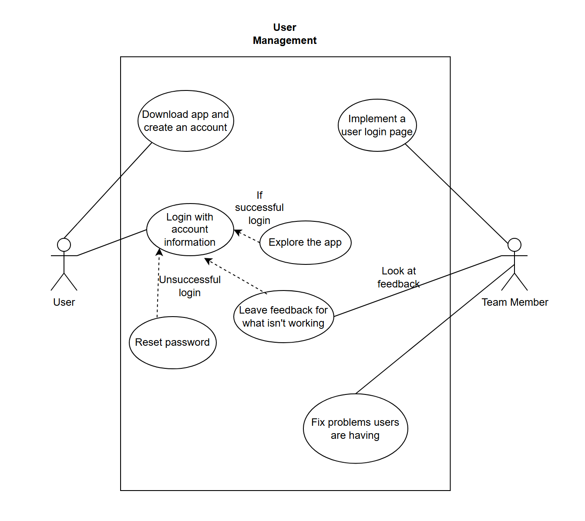
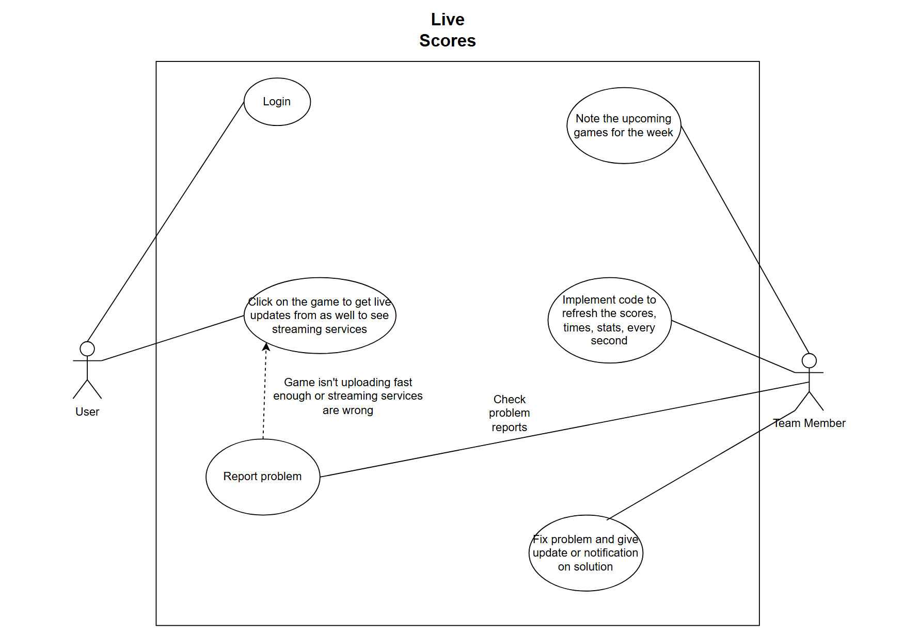
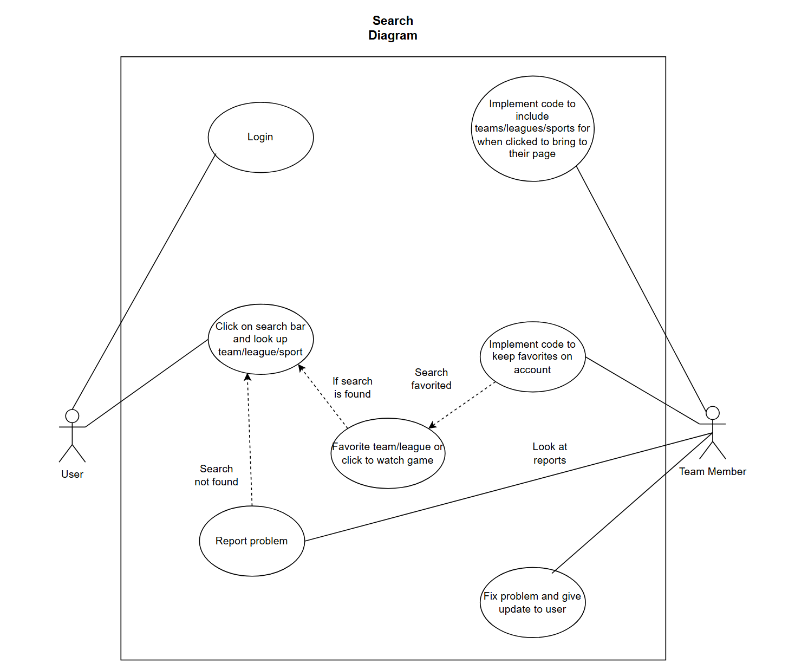

# Software Analysis Deliverable

## System Description

The problem of inefficient access to sports game schedules and underpromotion of sports-related movies and shows affects sports fans. The impact of which is wasted time spent searching multiple websites for game schedules and broadcast channels and entertainment ratings. For sports fans who want to easily find broadcasting information for games and ratings for sports movies and shows. GameFanHub is a sports entertainment platform that consolidates live game schedules and ratings for sports-related content into one site. Unlike other platforms like ESPN or IMDB, our product focus on combining both sports schedules and movie ratings to provide a one-stop solution for sports enthusiasts. GameFanHub is a comprehensive sports entertainment platform that provides sports fans with up-to-date broadcasting information for sports games and ratings for sports movies, all in one place.

Stakeholders are **Users** like Sports Fans & Enthusiasts are general visitors of the website who can engage with the provided content. **Clients** like Sponsors & Advertisers are clients looking to advertise their products, they can provide funding by sponsorships and ads. **Developers** are Web delevopers, UI designers they will implement website features, optimize performance & ensure perfect user experience. **Product Managers** will work with developers and designers to use user feed back to adjust website accordingly **Competitors** are other Website/Apps who we compete with for audience engagement, ad revenue, etc... **Detractors** are critics who evaluate our website's credebility, accuracy & critique user experience.

**User Management** should have a user registration and log in, also with the ability to follow teams. **Live Scores** needs to match schedules and results with live score updates. **Search** should allow searching through catalog of movies or players and teams. The **performance** of the website should be able to respond within seconds and handle traffic. The **usability** should allow the user should to be able to easily navigate through the website. The website should be **scalable** to any screen size of the device it is on. The website should be able to be **available** almost all the time and on many devices. The website should be **compatable** on many different browsers. The website should be built in a way that it can easily be updated and **maintained**. 

Use Case 1: Login to website 
Actor: User,
Trigger: User wants to enter website,
Pre-Conditions: User has account,
Post-Condition: User is logged in and able to access website,

Success Scenario: 
1. User initiates login
2. User has valid credentials
3. User accesses website

Alternate Scenario:
2. User doesn't have valid credentials
3. Website informs of invalid login
4. Application asks user to reset password or report problem.

Use Case 2: Live action scores
Actor: User,
Trigger: User wants to see live updates or streaming services of a game,
Pre-Conditions: User is logged in and finds valid game,
Post-Condition: User can see live updates as well as the streaming services the game is on,

Success Scenario:
1. User initiates login
2. User finds a valid game
3. User clicks on game to enter status
4. Application is giving current status of game and streaming services. 

Alternate Scenario:
2. User can't find game
3. User is not given current status of game
4. User reports the problem

Use Case 3: Search 
Actor: User,
Trigger: User wants to find a team, league, or sport,
Pre-Conditions: User is logged in,
Post-Condition: User finds specific team, league, or sport wanted,

Success Scenario:
1. User is logged in
2. User searches for wanted thing. 
3. Application gives a screen of specified request
4. User clicks the game, league or sport to favorite or get live status.

Alternate Scenario:
2. Application can't find the search
3. Application gives an error message 
4. User can search again or report problem. 

**User Story 1:**
- **As a** big sports viewer and enjoyer,
- **I want** to recieve reminders of when my favorite team is going to play,
- **So that** I never miss a game of my team.
- **Priority:** Medium
- **Estimation:** 8 Hours

**User Story 2:**
- **As a** sports reporter,
- **I want** to know what channel each team is going to play on,
- **So that** I know what channel to tune into.
- **Priority:** High
- **Estimation:** 5 hours

**User Story 3:**
- **As an** avid sport movie lover,
- **I want** to know what are the highest rated sport movies are,
- **So that** I can enjoy a great sport movie for enjoyment.
- **Priority:** Intermiadate
- **Estimation:** 3 hours

**User Story 4:**
- **As a** sports enthusiast,
- **I want** to browse sports movies that are classics,
- **So that** I can stay updated with the old movies.
- **Priority:** Intermiadate
- **Estimation:** 6 hours

**User Story 5:**
- **As a** fan of specific sport teams,
- **I want** to be able to watch my favorite teams win on the networks I own,
- **So that** I can know if I will be able to watch my team.
- **Priority:** High
- **Estimation:** 12 hours

**User Story 6:**
- **As a** bored visitor of the site,
- **I want** to browse movies that sport lovers watch,
- **So that** I can keep growing my watched movie collection.
- **Priority:** Low
- **Estimation:** 2 hours

**User Story 7:**
- **As a** sport movie fan,
- **I want** to be able to filter sport moives by the sport,
- **So that** I can watch movies of the sport that I want.
- **Priority:** High
- **Estimation:** 7 hours

**User Story 8:**
- **As a** sports watcher,
- **I want** to be able to get movie recommendations of my favorite sport,
- **So that** I can continue to watch everything related to my sport.
- **Priority:** Intermiadate
- **Estimation:** 14 hours

**User Story 9:**
- **As a** sports lover,
- **I want** to be able to know at what time my favorite team will play at,
- **So that** I can be on time to watch the game in local time.
- **Priority:** High
- **Estimation:** 3 hours

**User Story 10:**
- **As a** big movie critic,
- **I want** to be able to write and read reviews on specific movies,
- **So that** I can share my opinion and potentially see other reviewed movies.
- **Priority:** Intermiadate
- **Estimation:** 4.5 hours

## Model

Below is the UML class diagrams representing the conceptual model of the system. Each class is properly linked through the associations, and cardinalities are included where necessary.

