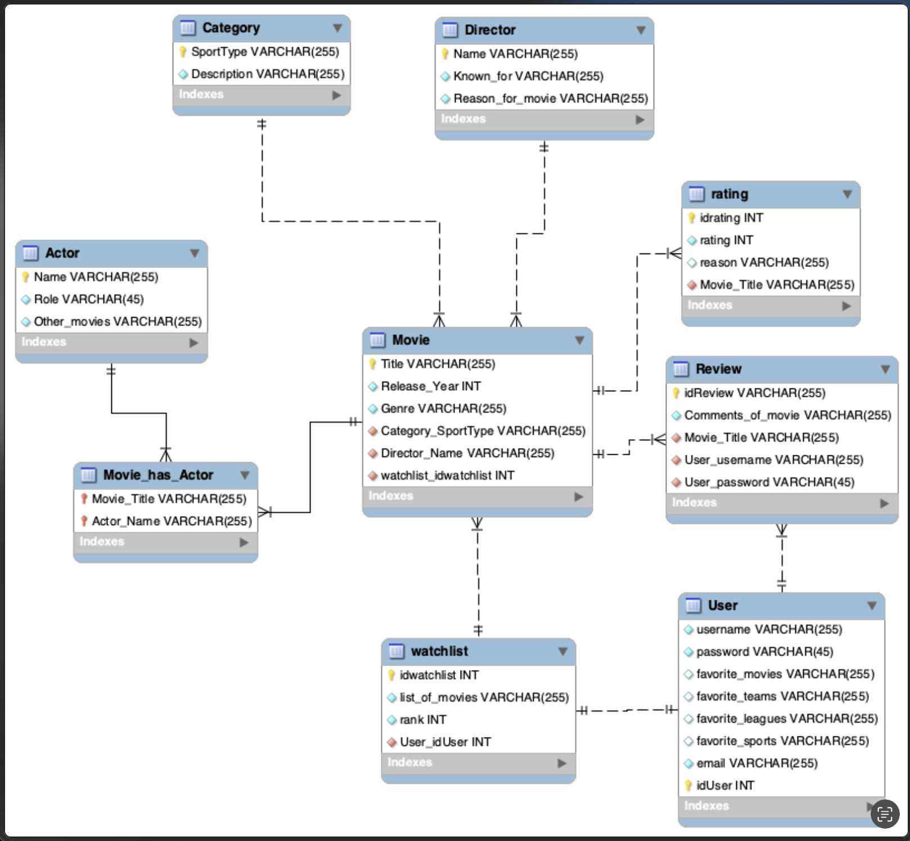

# Software Analysis Deliverable

## System Description

The problem of inefficient access to sports **game** **schedules** and underpromotion of sports-related **Movies** and shows affects sports fans. The impact of which is wasted time spent searching multiple websites for **game** **schedules** and **broadcast** _channels_ and entertainment **ratings**. For sports fans who want to easily find **_broadcasting_** _information_ for **games** and **rating** for sports **Movies** and shows. GameFanHub is a sports entertainment platform that consolidates live **game** **schedules** and **ratings** for sports-related content into one site. Unlike other platforms like ESPN or IMDB, our product focus on combining both sports **schedules** and _movie ratings_ to provide a one-stop solution for sports enthusiasts. GameFanHub is a comprehensive sports entertainment platform that provides sports fans with up-to-date broadcasting information for sports games and **ratings** for sports **Movies**, all in one place. **Movies** will be able to hold a **Genre**, that helps _get sports movies by Genre_. 

## Stakeholders & Requirements
**Users** like Sports Fans & Enthusiasts are general visitors of the website who can engage with the provided content. Clients like Sponsors & Advertisers are clients looking to advertise their products, they can provide funding by sponsorships and ads. Developers are Web delevopers, UI designers will implement website features, optimize performance & ensure perfect **User** experience. Product Managers will work with developers and designers to use **User** feed back to adjust website accordingly. Competitors are other Website/Apps who we compete with for audience engagement, ad revenue, etc... Detractors are critics who evaluate our website's credibility, accuracy & critique **User** experience. User Management should have a _user registration_ and _log in_, also with the ability to **_follow teams_**. **User** should be able to mark **movies** as **_watched_**. _Live Scores_ needs to match **schedules** and results with _live score updates_. **User** should be able to easily **_track_** or pay attention to a game with _live score updates_. Search should allow searching through catalog of **Movies** or players and teams. The performance of the website should be able to respond within seconds and handle traffic. The usability should allow the **User** should to be able to easily navigate through the website. The website should be scalable to any screen size of the device it is on. The website should be able to be available almost all the time and on many devices. The website should be compatable on many different browsers. The website should be built in a way that it can easily be updated and maintained. 

## Use Cases & User Stories
The system provides **users** with essential features for accessing and engaging with sports-related content. The _login_ use case ensures that **users** with valid credentials can securly access their personalized website, while those with invalid credentials are prompted to reset their password or report issues. Once logged in, **users** can view _live scores_, including real-time updates and **_streaming_** network listing for games. If a game cannot be found, users can report the issue. Additionally, the search functionality allows **users** to find **teams**, leagues, or sports of interest, with the option to favorite them to receive live updates. If a search fails, the system provides an error message and allows users to try again. The user stories highlight the needs of different users, including sports viewers who want reminders for their favorite teams, sports reports needing _channel information_, and sports enthusiasts looking for highly rated films. Each feature is designed to enhance user experience by providing timely and relevant sports information.

## Model

Below is the UML class diagram representing the conceptual model of the system. Each class is properly linked through the associations, and cardinalities are included where necessary.

