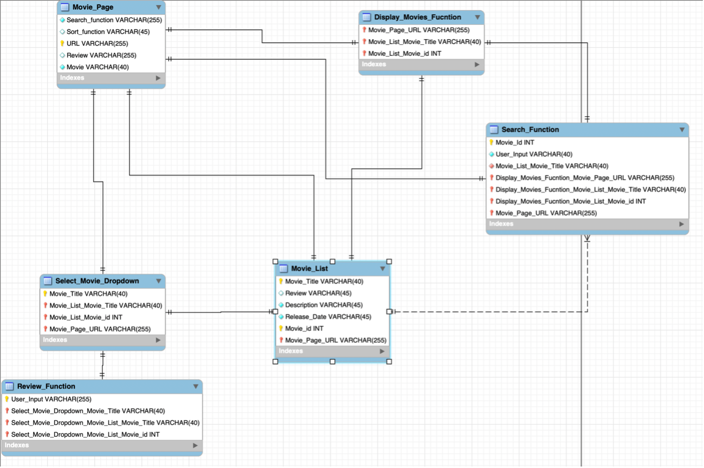
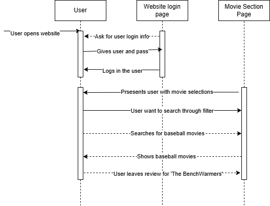
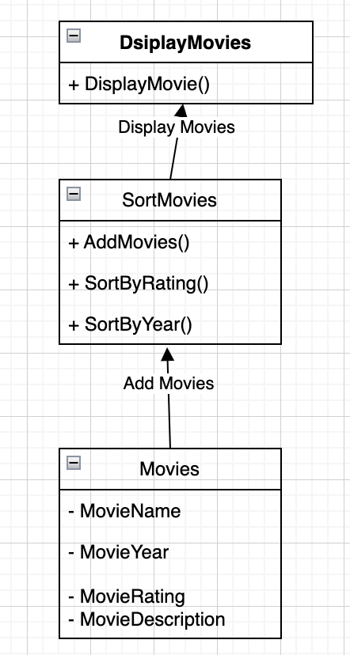
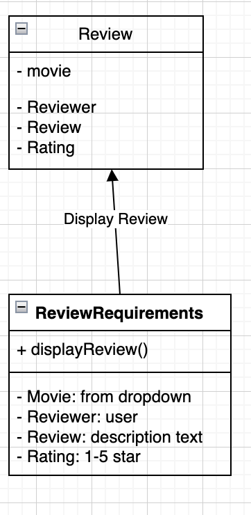
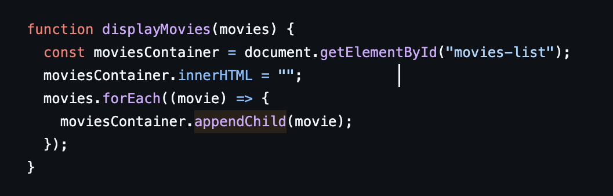
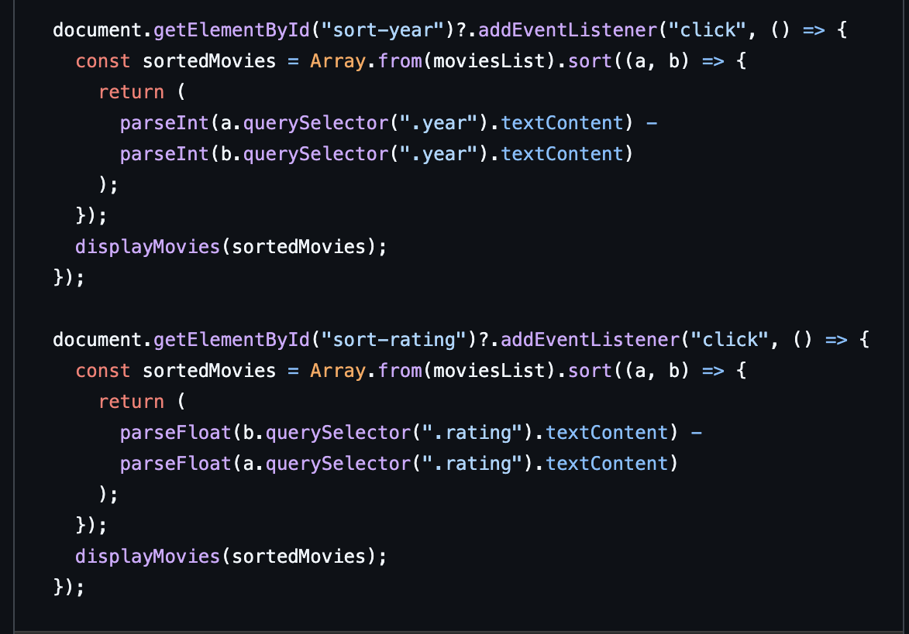

## Description
GameFanHub is a comprehensive sports entertainment platform that provides sports fans with up-to-date broadcasting information for sports games and ratings for sports movies, all in one place. It offers up-to-date broadcasting information for live sports games, ensuring that users never miss a match, while also delivering curated ratings and recommendations for sports movies, making it easy for fans to find the best content. The platform combines real-time data with a user-friendly interface, allowing users to quickly access game schedules, streaming options, and movie reviews in one convenient location. By integrating both live sports and entertainment content, GameFanHub creates a seamless and engaging experience for sports enthusiasts.

## Architecture 

The architecture follows the Model-View-Controller (MVC) pattern to ensure modularity, scalability, and maintainability. The User Interface (View) handles user interactions, while the Controller processes requests and communicates with the Model, which manages data using MongoDB. The Backend (Node.js with Express.js) efficiently handles routing and integrates with external APIs for real-time sports data. This separation of concerns allows for easy updates and scalability without affecting other components. The design ensures a responsive user experience while maintaining efficient data processing and retrieval.
## Class Diagrams

## Sequence Diagrams

This sequence diagram illustrates the interaction between a user, a website login page, and a movie section page. The process begins when the user opens the website and is prompted to enter login credentials. After providing the username and password, the user is successfully logged in. The system then presents the user with movie selections. The user decides to search for baseball movies through a filter. The system processes the search request and displays relevant baseball movies. Finally, the user leaves a review for the movie 'The Benchwarmers'.
## Design Patterns

 
Structural: The movies will all be added individually as cards. These all hold the name of the movie, image, description and rating. These movies can be sorted/filtered by rating or by year. This would change the way that these movies are displayed. Therefore determining the structure. 
 
Movies: [Movies implemented in HTML](https://github.com/Braydew-NAU/SportsWebsite/edit/main/index.html)
 
Sorts: [Movie cards are created/designed in CSS](https://github.com/Braydew-NAU/SportsWebsite/edit/main/styles.css)
 
 

 
Creational: The reviews are created individually as they are added. The reviews will be added whenever they have a name, description, rating, and movie selected, then implemented into the reviews as a card. This being creational because the user creates the reviews. 
 
Reviews: [Reviews done in JS file](https://github.com/Braydew-NAU/SportsWebsite/edit/main/script.js)

## Design Principles
In our java script code, we have a single responsible principle. This function is only responsible for displaying the movies when a customer visits the site.  

 

In our java code again, we have open/closed principle. These functions are responsible for sorting out movies for user when they search for it.  

 

We have interface segregation principles in our index html file by keeping our reviews, search, and movie displays all separate. Each client specific interface is its own and not one general purpose interface.
