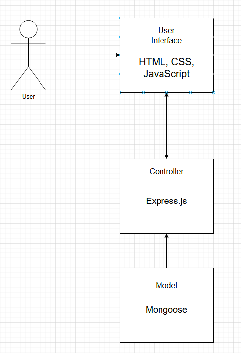

## Description
GameFanHub is a comprehensive sports entertainment platform that provides sports fans with up-to-date broadcasting information for sports games and ratings for sports movies, all in one place. It offers up-to-date broadcasting information for live sports games, ensuring that users never miss a match, while also delivering curated ratings and recommendations for sports movies, making it easy for fans to find the best content. The platform combines real-time data with a user-friendly interface, allowing users to quickly access game schedules, streaming options, and movie reviews in one convenient location. By integrating both live sports and entertainment content, GameFanHub creates a seamless and engaging experience for sports enthusiasts.

## Architecture 

The architecture follows the Model-View-Controller (MVC) pattern to ensure modularity, scalability, and maintainability. The User Interface (View) handles user interactions, while the Controller processes requests and communicates with the Model, which manages data using MongoDB. The Backend (Node.js with Express.js) efficiently handles routing and integrates with external APIs for real-time sports data. This separation of concerns allows for easy updates and scalability without affecting other components. The design ensures a responsive user experience while maintaining efficient data processing and retrieval.
## Class Diagrams

## Sequence Diagrams

## Design Patterns

## Design Principles
