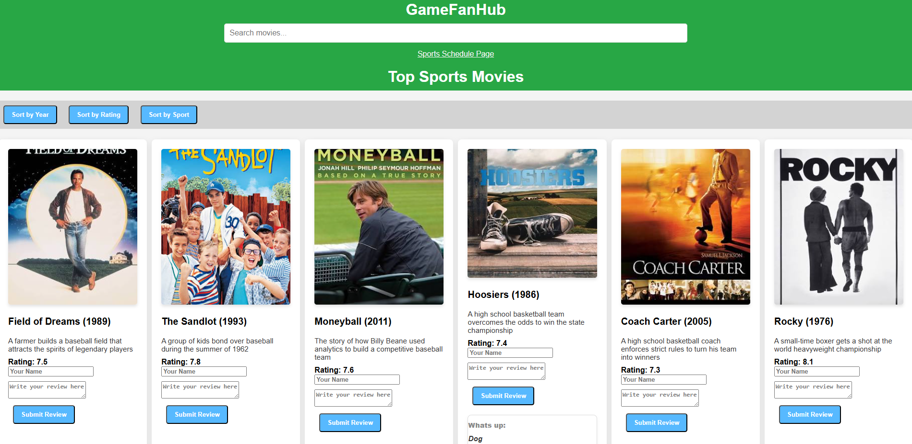

# Implementation 2 Deliverable

## Introduction
GameFanHub is a comprehensive sports entertainment platform that provides sports fans with up-to-date broadcasting information for sports games and ratings for sports movies, all in one place. It offers up-to-date broadcasting information for live sports games, ensuring that users never miss a match, while also delivering curated ratings and recommendations for sports movies, making it easy for fans to find the best content. The platform combines real-time data with a user-friendly interface, allowing users to quickly access game schedules, streaming options, and movie reviews in one convenient location. By integrating both live sports and entertainment content, GameFanHub creates a seamless and engaging experience for sports enthusiasts. [Link To GitHub](https://github.com/Braydew-NAU/SportsWebsite)

## Requirements

Requirement: As a sports lover, I want to be able to know at what time my favorite team will play at, so that I can be on time to watch the game in local time. Also the channel the game will be broadcasted on so I know where to go to tune in.
 
Issue: [Link to Issue](https://github.com/Braydew-NAU/SportsWebsite/issues/27)
 
Pull request: [Link to Braydon's Pull request](https://github.com/Braydew-NAU/SportsWebsite/pull/83) [Link to Tyler's Pull Request](https://github.com/Braydew-NAU/SportsWebsite/pull/85)
 
Implemented by: Braydon Lamoreaux, Tyler Edwards
 
Approved by: Tyler Edwards, Braydon Lamoreaux
 
Print screen: 

Requirement: As a sports watcher, I want to be able to get movie recommendations of my favorite sport, so that I can continue to watch everything related to my sport.
 
Issue: [Link to Issue](https://github.com/Braydew-NAU/SportsWebsite/issues/26)
 
Pull request: [Link to Diego's Pull Request](https://github.com/Braydew-NAU/SportsWebsite/pull/87)
 
Implemented by: Diego Garcia
 
Approved by: Braydon Lamoreaux
 
Print screen: 

Requirement: As a sport movie fan, I want to be able to filter sport movies by the sport, so that I can watch movies of the sport that I want. Also filter by the movie ratings.
 
Issue: [Link to Issue](https://github.com/Braydew-NAU/SportsWebsite/issues/25)
 
Pull request: [Link to Duran's Pull Request](https://github.com/Braydew/NAU/SportsWebsite/pull/84)
 
Implemented by: Diego Duran
 
Approved by: Diego Garacia
 
Print screen: 

Requirement: As an avid sport movie lover, I want to know what are the highest rated sport movies are, so that I can enjoy a great sport movie for enjoyment.
 
Issue: [Link to Issue](https://github.com/Braydew-NAU/SportsWebsite/issues/12)
 
Pull request: [Link to Mitchell's PR](https://github.com/Braydew-NAU/SportsWebsite/pull/75)
 
Implemented by: Mitchell Morris
 
Approved by: Tyler Edwards
 
Print screen: 

## Tests
 

The framework used to develop our tests was Jest and JavaScript scripts to automate our testing. The folder on our GitHub where our automated tests are located are in the [tests](https://github.com/Braydew-NAU/SportsWebsite/tree/main/_tests_) folder. There is only one updated test, and that is the [sortMovies test](https://github.com/Braydew-NAU/SportsWebsite/blob/main/_tests_/sortMovies.test.js), this is updated because we fixed the initial 2 sort buttons and as well added a third one that sorts by sports. The class being tested by said test is [sort Movie buttons](https://github.com/Braydew-NAU/SportsWebsite/blob/main/script.js). The output result is [here](https://github.com/Braydew-NAU/SportsWebsite/blob/main/Deliverables/DeliverableImages/Test_Result.png), this is testing all tests again. 

 

## Demo

## Code Quality

## Lessons Learned
